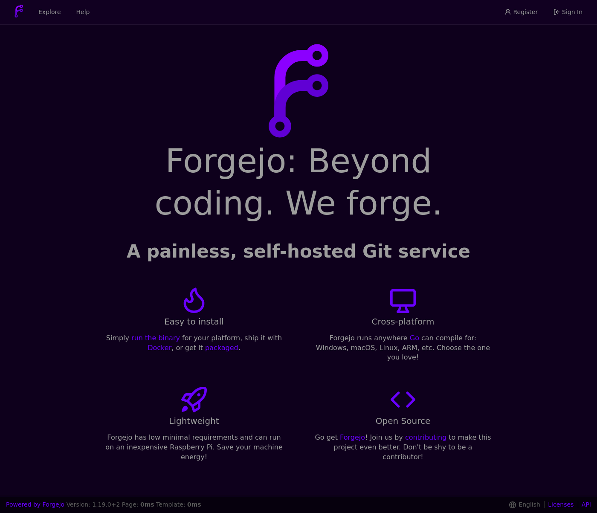

# forgejo-purple-fever



# Downloading

We can simply download the last version with:

```
git clone https://github.com/GolDNenex/forgejo-purple-fever
cd forgejo-purple-fever
```

# Copying files
We need to copy the folder `public` in the `CustomPath folder`.

If you are using Docker, the environment variable `GITEA_CUSTOM` need to be set. 

### Example docker-compose.yaml:

```
version: "3"

networks:
  forgejo:
    external: false

services:
  server:
    image: codeberg.org/forgejo/forgejo:1.19.0-2
    container_name: forgejo
    environment:
      - USER_UID=1000
      - USER_GID=1000
      - GITEA_CUSTOM=/data/gitea
    restart: always
    networks:
      - forgejo
    volumes:
      - /path/to/forgejo:/data
      - /etc/timezone:/etc/timezone:ro
      - /etc/localtime:/etc/localtime:ro
    ports:
      - "4888:3000"
      - "222:22"

```

So in this example, the folder we looking for is `/path/to/forgejo/gitea`. To copy the files, we can do:

```
cp -r ./public/ /path/to/forgejo/gitea/
```

If you don't use docker, this should be your running folder. More infos [here](https://docs.gitea.io/en-us/customizing-gitea/#customizing-gitea).


# Configuration

Finally we need to add the theme in the config at `/path/to/forgejo/gitea/conf/app.ini`.

# Follow one of the two options:

## I already have some custom themes

Simply add `,forgejo-purple-fever` at the end of `THEMES`.

## I don't have any custom themes 

You need to add the following in your config depending of if you are using forgejo or gitea. Asuming you want to provide all the usable themes:

* Forgejo:

```
[ui]
THEMES = gitea,arc-green,forgejo-dark,forgejo-light,forgejo-auto,forgejo-purple-fever
DEFAULT_THEME = forgejo-purple-fever
```
* Gitea:

```
[ui]
THEMES = gitea,arc-green,forgejo-purple-fever
DEFAULT_THEME = forgejo-purple-fever
```
